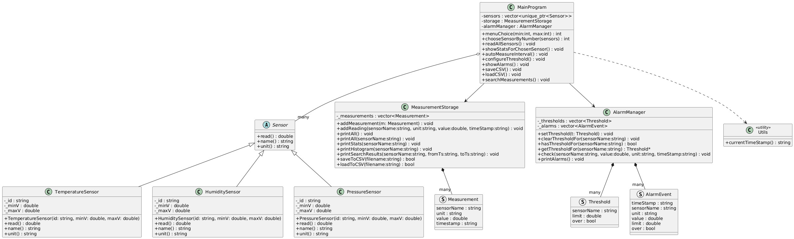

# Multi-Data System

#### [Source]
https://github.com/NoJi-nx/multi-sensor-system


En C++ applikation som använder polymorfism för att simulera sensorer, samla in mätningar, beräkna statistik, löser ut tröskellarm och sparar/laddar dat med hjälp av CSV-filer.

## Beskrivning

Projektet implementerar ett sensormätningssystem i IoT-stil med modern C++.
Det simulerar temperatur-, fuktighets- och trycksensorer genom polymorfism, samlar in och lagrar alla mätningar, beräknar statistik, visar ASCII-histogram, loggar tröskelbaserade larm och stöder CSV-sparnings-/laddningsoperationer. Programmet följer en ren OOP-design med unique_ptr, abstrakta basklasser och ansvarsseparerade komponenter.

## Funktioner

* Tre simulerade sensortyper ( temperatur,fuktighet, tryck) med polyformism

* Abstrakt sensrobasklass med OOP design


* Mätlagring med tidsstämplade mättnigar

* Statistisk analys per sensor (medelvärde, min, max, std dev, antal)

* ASCII-histogramvisulaisering av avläsningar

* Konfigurerbara tröskellarrm med loggning


* CSV spar- och laddnings funktion


* Filtrera mätningar eftter sensor tidsstämpel

* Menydrivet användargränssnitt


## Projekt Struktur

```
main.cpp
 -> Programstartpunkt. Skapar sensorer, lagring, larmhanterare och överlämnar kontrollen till menyn/styrenheten.
 
 MenuController.h / MenuController.cpp
 -> Menylogik och användarinteraktion:
- Visar huvudmenyn
- Läser användarval


utils.h / utils.cpp  
-> Hjälpfunktioner för formaterade tidsstämplar

sensor.h  
-> Abstrakt senspr basklass

measurement.h
-> Struct representerar en mätvärde:
 - sensor namn
 - enhet
 - värde
 - tidsstämpel

 TemperatureSensor.h / TemperatureSensor.cpp
 -> Sensor som simulerar temperaturmätningar

 HumiditySensor.h / HumiditySensor.cpp 
 -> Sensor som simulerar fuktighetsmätningar


 PressureSensor.h / PressureSensor.cpp
 -> Sensor som simulerar trycksmätningar


MeasurementStorage.h / MeasurementStorage.cpp
-> Central lagring och analys:
 - Lagra alla mätningar
- Beräkna statistik (medelvärde, min, max, stddev)
- Skriv ut tabeller per sensor och ASCII-histogram
- Spara till / ladda från CSV-filer
- Sök/filtrera mätningar efter sensor och tidsintervall


AlarmManager.h / AlarmManager.cpp
-> Tröskelbaserat larmsystem
 - Lagra tröskelregler per sensor
 - Kontrollera värden mot tröskelvärden
 - Logga utlösta larm
 - Skriv ut larmhistorik 
 
```

## Kompilation & start

Skriv i terminalem i projektmappen:
```
g++ 
    main.cpp \
    MenuController.cpp \
    TemperatureSensor.cpp \
    HumiditySensor.cpp \
    PressureSensor.cpp \
    MeasurementStorage.cpp \
    AlarmManager.cpp \
    utils.cpp

```

Kör programmet

```
./sensor_system
````

På Windows:

```
sensor_system.exe
```

VS Code (Rekommenderad)

Vs code Använder tasks.json för att kompilerar.

Använd genvägen

macOS:
```
Cmd + Shift + B
```

Windows/Linux:
```Ctrl + Shift + B
```

## Användning


| Alternativ | Beskrivning |
|----------|-------------|
| 1. Read new measurements from all sensors | Låter användaren mata in värden manuellt och sparar tidstämpel för varje mätning. |
| 2. Display statistics for a sensor | Visa statistik för en sensor Låter användaren välja en sensor och sedan skriva ut: antal, medelvärde, min, max, standardavvikelse, tidsspann och ett ASCII-histogram.|
| 3. Display all measurements | Visa alla mätningar Skriver ut alla lagrade mätningar i tabellformat (tidsstämpel, sensornamn, värde, enhet). |
| 4. Save measurements to CSV | Spara mätningar till CSV Sparar alla insamlade mätningar till ett användardefinierat CSV-filnamn. |
| 5. Load measurements from CSV | Läser in mätdata från en CSV-fil och ersätter den aktuella datamängden. |
| 6. Automatic measurement in intervals | Läser upprepade gånger alla sensorer under ett givet antal cykler och tidsintervall (sekunder) |
| 7. Configure threshold rule (alarms) | Låter användaren ställa in en tröskelgräns och riktning (över/under) |
| 8. Show alarms | Skriver ut en lista över alla utlösta larmhändelser med tidsstämpel, sensornamn, värde och bruten regel |
| 9.Search measurements | Filtrerar mätningar efter sensornamn och tidsstämpelintervall (FROM, TO). Resultaten visas i tabellformat.|
| 10.Exit | Stoppar Programmet|

<br>

## UML Diagram
<br>



